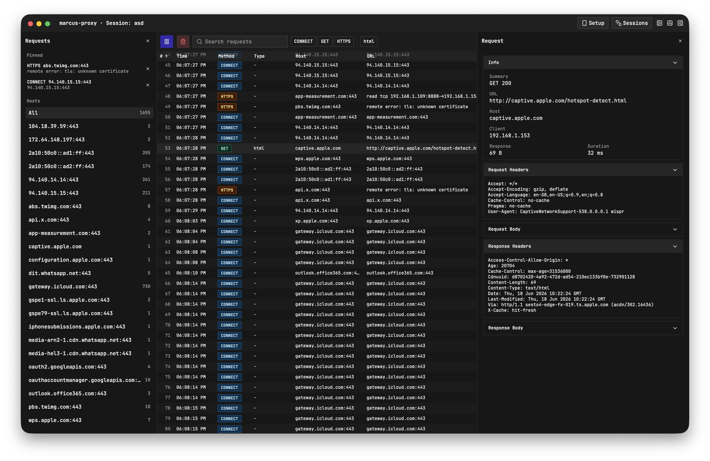

# Marcus Proxy

A forward proxy for capturing API traffic from mobile apps. Built with Go, TypeScript, and Wails.

<p align="center">
  
</p>

## Download

Download the latest builds for MacOS and Windows:

- [MacOS](https://github.com/mebn/marcus-proxy/releases/latest/download/Marcus-Proxy-1.0.1-macOS-universal.zip)
- [Windows](https://github.com/mebn/marcus-proxy/releases/latest/download/Marcus-Proxy-1.0.1-windows-amd64-installer.exe)

## Background

I like poking around mobile apps to see how they work behind the scenes. I've spent a lot of time using tools like Charles Proxy and Proxyman to inspect traffic, understand APIs, and figure out how different apps communicate with their backend services.

Eventually I got tired of wishing these tools worked a little differently, so I decided to build my own.

Marcus Proxy is a forward proxy built for exploring and understanding mobile app traffic. Since many apps don't use certificate pinning, it's often possible to inspect the requests and responses they send, making it much easier to understand undocumented APIs, debug network behavior, and reverse engineer how an app works.

It's also a fun sideproject to spend tokens on iykwim ;)

## Features

Current features:

- Capture and inspect HTTP/HTTPS traffic from mobile apps
- View request and response headers, bodies, and metadata
- Intercept, modify, and forward requests and responses
- Replay and resend modified requests
- Quick Capture mode for getting started in seconds
- Save and restore capture sessions
- Search and filter captured traffic
- Organize requests by host and pinned items
- Flexible request detail layouts (bottom, right, and sidebar panels)
- Light mode (use at your own risk)

## Development

Start a development server with hot reload:

```bash
wails dev
```

### Prerequisites

- [Go](https://go.dev/)
- [Wails](https://wails.io/)
